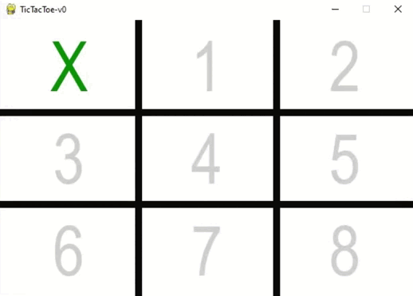

# classic-games
This Python Library is an extension to the gym library, which includes classic board games like
(chess, tic-tac-toe, four-wins and many more in the future)

## Example of playing TicTacToe


### Setup metadata
The following example shows how to change the metadata of the environment:
```python
from classic_games.tictactoe.model.metadata import Metadata

meta = Metadata(
    board_shape=(3, 3),  # shape of the TicTacToe Board
    tiles_to_win=3,  # number of tiles you/enemy needs to win
    your_symbol=1,  # number to identify your moves
    enemy_symbol=-1,  # number to identify enemy moves
)
```

### Setup enemy player
Before you can create a TicTacToe Environment, you need to define an enemy player to play against him.
The following example shows how to define an enemy, that takes a random (possible) action for the given state.
```python
from classic_games.tictactoe.agent.random_player import RandomPlayer

enemy_player = RandomPlayer(your_symbol=-1, enemy_symbol=1, tiles_to_win=3)
```

### Setup TicTacToe Environment
With the enemy player and the given metadata before, we can now create the TicTactoe Environment,
where you can play against the enemy player.
```python
import gymnasium as gym

env = gym.make("TicTacToe-v0", render_mode="human", rule_settings=meta, enemy_player=enemy_player)
```

### Run the gym loop
Now you have created the TicTacToe Environment, which can now be used like any other gymnasium environment to do RL.
The following example shows of how to use the TicTacToe Environment to play with a Minimax Agent against the random
player:
```python
from classic_games.tictactoe.agent.min_max_playerC import MinMaxPlayerC

your_player = MinMaxPlayerC(your_symbol=1, enemy_symbol=-1, tiles_to_win=3)
for i in range(10):  # Play 10 games
    observation, info = env.reset()
    your_player.reset()
    reward = 0.0
    for _ in range(5):  # Number of rounds (5 should be enough for 3x3 board)
        action = your_player.act(observation)
        observation, reward, terminated, truncated, info = env.step(action)
        
        if terminated or truncated:
            break

    print(f"Epoch {i}: {reward}")
```